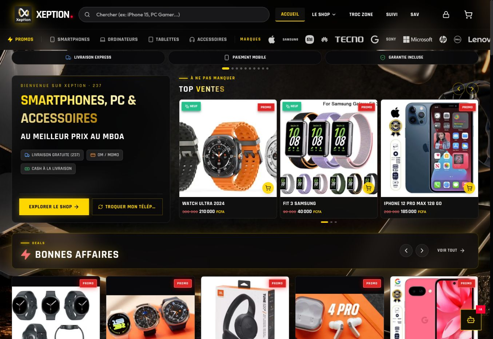
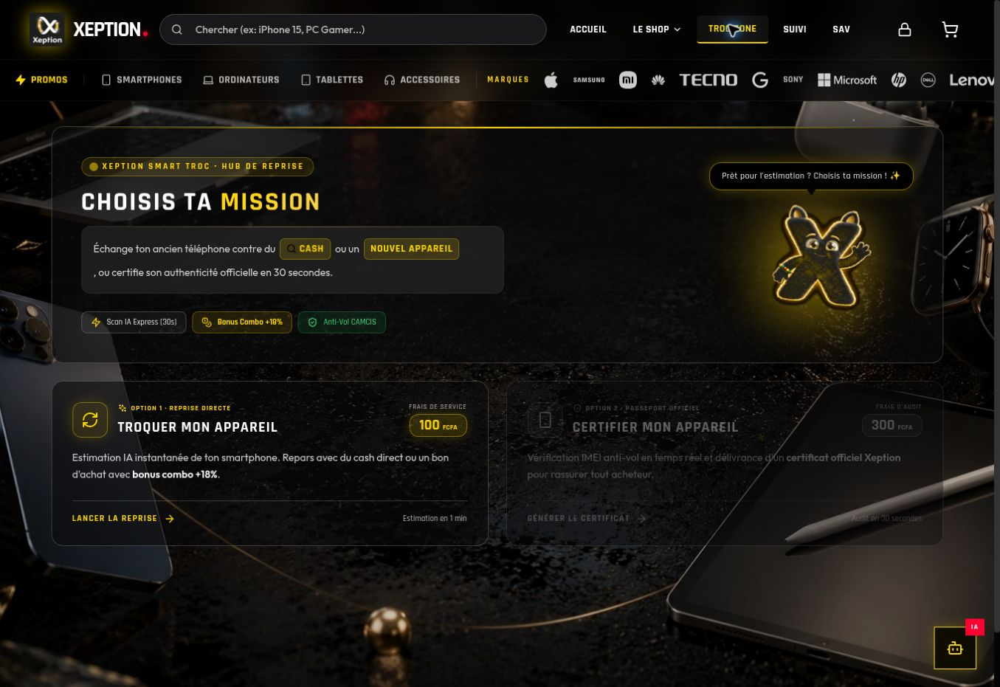
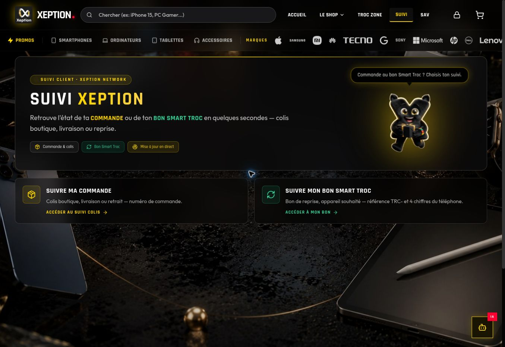
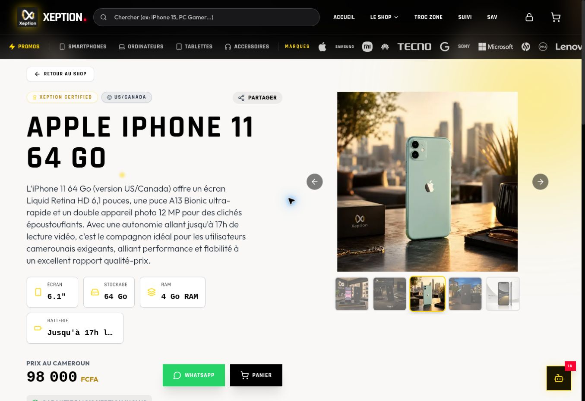

# XEPTION Network

**Production e-commerce and operations platform built for XEPTION in Cameroon.**

The application combines the public storefront with the operational tools needed to run the business: catalogue management, orders, stock, local payments, point of sale, after-sales service and device trade-ins.

<p align="center">
  <a href="https://www.xeptionetwork.shop/"><strong>Open the live storefront</strong></a>
</p>

<p align="center">
  <a href="https://www.xeptionetwork.shop/">
    
  </a>
</p>

## Product views

| Smart Troc | Shop catalogue |
| --- | --- |
|  |  |

| Order tracking | Product detail |
| --- | --- |
|  |  |

## Main capabilities

- **E-commerce storefront** — product catalogue, product pages, cart, checkout and order tracking
- **Inventory & operations** — product, category, brand and stock management
- **Local payments** — Orange Money and MTN Mobile Money flows, with CamPay integration where required
- **Smart Troc** — guided device trade-in workflow with IMEI checks, photos, evaluations and vouchers
- **After-sales service** — repair and SAV ticket workflows
- **Point of sale** — operational support for in-store sales
- **Administration** — staff access, orders, products, promotions and operational dashboards
- **SEO / discoverability** — sitemap generation, prerendering and search-engine-oriented build steps

## Architecture

```text
React 18 + TypeScript + Vite
            │
            ▼
       Supabase APIs
            │
            ▼
PostgreSQL + database policies
```

The frontend is built as a Vite application. Supabase provides the main backend/data layer, while project scripts handle database migrations, catalogue ingestion, prerendering and deployment tasks.

## Stack

- **Frontend:** React 18, TypeScript, Vite, Tailwind CSS
- **Backend / data:** Supabase, PostgreSQL
- **Payments:** CamPay, Orange Money, MTN Mobile Money
- **Testing:** Vitest, Testing Library, Playwright
- **SEO / rendering:** prerendering, sitemap generation, structured build scripts
- **Utilities:** ExcelJS, QR codes, PDF generation

## Development

### Requirements

- Node.js
- npm
- a Supabase project for database-backed features

### Setup

```bash
git clone https://github.com/EagleFox31/xeption237.git
cd xeption237
npm install
cp .env.example .env
npm run dev
```

### Useful commands

```bash
npm run dev              # local development
npm run build            # production build + sitemap + prerendering
npm test                 # automated tests
npm run test:integration # integration tests
npm run test:coverage    # coverage report
npm run db:status        # migration status
npm run db:verify        # database migration checks
```

## Project status

**Status: Production**

The current work focuses on catalogue quality, SEO/GEO improvements, automated testing and continued reliability of the commerce and operational workflows.

## Repository note

This is a real client project, not a starter template. Public documentation describes the product and technical architecture without exposing private customer data, credentials or production configuration.

## Ownership and licensing

The original software implementation, application architecture and technical components in this repository are proprietary to **EagleFox31** and are published under the **AgenStudio** brand.

Client-provided product catalogues, business and customer data, brand assets, commercial content, credentials and production service accounts remain the property or under the control of the client and their respective account holders. This includes production **CamPay** and mobile-money merchant accounts.

Third-party libraries and services remain subject to their own licences and terms. See [`LICENSE`](LICENSE) for the repository terms.
