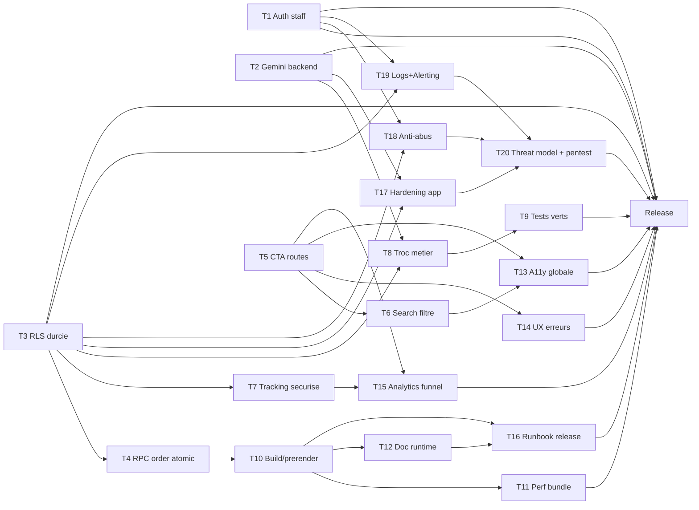

# Plan de Remediation Xeption237 (Priorise + PERT)

Date: 2026-03-31  
Contexte: audit technique/UX de l'etat actuel du repo.  
Hypothese validee: **le module Troc est en dev**, donc **pas de priorite UI polish** sur Troc dans ce plan.

## 1) Objectif et ordre de priorite

Objectif global: stabiliser la prod, securiser les flux sensibles, reparer les parcours business critiques, puis durcir la qualite.

Priorites:
1. **P0 - Securite et blocages prod**
2. **P1 - Conversion business (routing + checkout + tracking + admin)**
3. **P2 - Fiabilite technique (tests, build, perf, observabilite)**
4. **P3 - Accessibilite et UX globale hors Troc polish**
5. **P4 - Industrialisation (runbook, dette, gouvernance)**

## 1.1) Surface d'attaque estimee (combien de facons un attaquant peut entrer)

Estimation actuelle: **au moins 14 vecteurs d'attaque** a couvrir.

1. Brute force / credential stuffing sur login staff.
2. Bypass ou contournement de captcha (automation).
3. Exposition de secrets cote client (API keys, config sensible).
4. RLS trop permissive (lecture/maj de donnees non autorisee).
5. Enumeration des commandes (ID predictible type `ORD-xxxxxx`).
6. Abus des Edge Functions (`check-imei`, `send-invoice`) par flood.
7. Abus upload media (fichiers trop lourds/type non filtre).
8. Injection/XSS via contenus persistes (reviews, descriptions, notes).
9. Dependances externes runtime (CDN/importmap/scripts tiers) non durcies.
10. Absence/insuffisance d'entetes de securite (CSP, HSTS, frame-ancestors).
11. Vol/rejeu de session (gestion cookies/tokens insuffisante).
12. DoS applicatif sur endpoints lourds (IA, prerender, upload).
13. Privileges internes trop larges (staff "full access" sans segregation).
14. Fuite de secrets en CI/depot (env, logs, scripts).

Conclusion: la question n'est pas "une faille unique", mais un **systeme de defenses en couches**.

---

## 2) Backlog priorise (avec livrables)

## P0 - Securite et blocages prod (immediat)

### T1 - Corriger auth staff (password clair cote client)
- Probleme: verification `staff` avec `eq('password', password)` cote client.
- Action:
  - Supprimer toute comparaison de password cote front.
  - Passer uniquement par `supabase.auth.signInWithPassword`.
  - Migrer les comptes staff sur auth Supabase si necessaire.
- Livrable: login staff sans lecture password SQL.
- Critere de sortie: aucun password staff dans requete front.
- Etat au 31/03/2026:
  - Front: OK (auth via Supabase Auth + check staff par email).
  - UI admin: OK (champ password retire des formulaires staff).
  - DB: migration ajoutee `supabase/migrations/20260331_001_staff_remove_plain_password.sql` (a appliquer en environnement cible).

### T2 - Retirer la cle Gemini du front
- Probleme: cle API exposee via build (`process.env.API_KEY`).
- Action:
  - Deplacer Gemini (chat/eval/video) vers Edge Functions/backend.
  - Utiliser token court ou session backend.
- Livrable: front sans cle provider sensible.
- Critere de sortie: aucune cle secrete exploitable dans bundle.

### T3 - Nettoyer policies RLS trop permissives
- Probleme: policies `USING (true)` trop larges (orders/staff/autres).
- Action:
  - Reviser SQL policies par role/cas d usage.
  - Restreindre lecture commande a son proprietaire/session.
- Livrable: script SQL durci versionne dans migrations.
- Critere de sortie: tests d acces passes (anon/auth/staff).

### T4 - Stabiliser endpoint/order atomic
- Probleme: appel `rpc('create_order_atomic')` sans definition versionnee dans repo.
- Action:
  - Ajouter migration SQL de la fonction RPC (source of truth).
  - Ajouter test integration minimal.
- Livrable: migration + verification deploy.
- Critere de sortie: checkout OK en env clean.

### T17 - Hardening applicatif (headers + scripts + CSP)
- Probleme: surface XSS/supply-chain elevee (scripts/CDN runtime).
- Action:
  - Definir CSP stricte (nonce/hash si necessaire), HSTS, X-Frame-Options/frame-ancestors, Referrer-Policy.
  - Reduire dependances script runtime non essentielles, activer SRI quand possible.
  - Sanitizer systematique pour contenu rendu venant de DB.
- Livrable: baseline OWASP web hardening appliquee.
- Critere de sortie: scan headers OK + test XSS reflechi de base bloque.

### T18 - Protection anti-abus (rate limit + anti-enumeration)
- Probleme: endpoints critiques abusables, ID commande predictible.
- Action:
  - Rate limiting par IP/session sur login, tracking, edge functions, upload.
  - IDs non predictibles (UUID court ou token tracking derive).
  - Bloquage progressif et cooldown apres echecs login.
- Livrable: mecanismes anti-bruteforce/anti-scraping actifs.
- Critere de sortie: script d'abus simple bloque (429/lockout).

### T19 - Journalisation securite + alerting
- Probleme: detection tardive des attaques.
- Action:
  - Audit logs sur auth, echec login, changements roles, acces admin, erreurs critiques.
  - Alerting (email/Slack) sur seuils anormaux.
- Livrable: detection proactive securite.
- Critere de sortie: 1 dashboard + 3 alertes automatiques operationnelles.

### T20 - Threat modeling + mini pentest avant go-live
- Probleme: pas de validation offensive finale centralisee.
- Action:
  - Atelier STRIDE leger (assets, menaces, controles).
  - Pentest applicatif cible (auth, RLS, tracking, upload, edge functions).
  - Plan de remediations finales avec severite.
- Livrable: rapport securite pre-go-live.
- Critere de sortie: aucune faille critique/haute non traitee.

---

## P1 - Conversion business

### T5 - Corriger les routes cassees des CTA
- Probleme: liens `/?page=troc` et `/?page=sav` non geres.
- Action: remplacer par `navigate('/troc')` et `navigate('/sav')`.
- Livrable: tous les CTA majeurs menent a une page valide.
- Critere de sortie: test manuel des CTA home/hero/catalogue.

### T6 - Corriger la recherche/header categorie
- Probleme: clic categorie depuis search n applique pas filtre.
- Action: router vers `/shop?cat=<slug>` (+ conserver brand si utile).
- Livrable: navigation search -> listing filtre.
- Critere de sortie: category click = liste filtree.

### T7 - Fiabiliser tracking commande
- Probleme: lecture commandes possiblement trop ouverte (RLS) + UX tracking.
- Action:
  - Aligner policy + endpoint de tracking securise.
  - Garder parcours simple via `id` de commande.
- Livrable: tracking fiable sans fuite de donnees.
- Critere de sortie: commande trouvable seulement si autorisee.

### T8 - Activer Troc cote metier (sans polish UI)
- Probleme: `basePrice` du flow Troc reste a 0 => offres refusees.
- Action:
  - Connecter `useTradeIn` a `trade_in_models` (lookup marque/modele -> basePrice).
  - Harmoniser statut persisted vs voucher (`pending/accepted/...`).
  - Corriger insert `trade_in_requests` (retour ligne avec `select`).
- Livrable: Troc fonctionnel metier de bout en bout.
- Critere de sortie: 3 cas reels (clean/orange/blacklisted) valides.

Note: **pas de chantier UI polish Troc** dans ce lot.

---

## P2 - Fiabilite technique

### T9 - Reparer tests rouges
- Probleme: 1 test KO (`TrocTab` requete texte trop large).
- Action: corriger test (query ciblee) et fiabiliser suite.
- Livrable: test suite verte.
- Critere de sortie: `npm test` = 100% pass.

### T10 - Fiabiliser prerender/build
- Probleme: echec sur port fixe 4173.
- Action:
  - Rendre le port configurable/fallback.
  - Gerer collision port et droits d ouverture.
- Livrable: build + prerender robustes en local/CI.
- Critere de sortie: `npm run build` passe sur env propre.

### T11 - Reduire poids bundle et dette runtime
- Probleme: bundle principal volumineux.
- Action:
  - code splitting (routes lourdes/admin/video/ai).
  - lazy load sections non critiques.
- Livrable: baisse JS initial.
- Critere de sortie: taille chunk principal reduite (cible -25%).

### T12 - Nettoyer incoherences de stack doc/runtime
- Probleme: README/versions/importmap/Tailwind CDN incoherents.
- Action:
  - aligner README, scripts, versions React, build path.
  - decider si Tailwind CDN est conserve (sinon pipeline CSS propre).
- Livrable: doc et runtime coherents.
- Critere de sortie: onboarding dev sans ambiguite.

---

## P3 - Accessibilite et UX globale (hors Troc polish)

### T13 - Accessibilite formulaires et navigation
- Action:
  - labels explicites + `htmlFor` + focus visible + keyboard support.
  - corriger tailles de texte critiques (<12px) sur parcours client.
- Livrable: parcours clefs plus lisibles et clavier friendly.
- Critere de sortie: checklist a11y de base validee.

### T14 - Standardiser feedback utilisateur
- Action:
  - remplacer `alert()` par toasts/messages inline.
  - uniformiser erreurs/retry sur checkout/login/upload.
- Livrable: UX d erreur coherente.
- Critere de sortie: aucun `alert()` dans parcours client/staff.

---

## P4 - Industrialisation

### T15 - Instrumentation business minimale
- Action:
  - events analytics: vue produit, add-to-cart, checkout start, checkout success, click troc.
- Livrable: funnel mesurable.
- Critere de sortie: dashboard conversion activable.

### T16 - Runbook + release checklist
- Action:
  - doc release, rollback, migrations SQL, smoke tests.
- Livrable: procedure de mise en prod repetable.
- Critere de sortie: checklist versionnee dans repo.

---

## 3) PERT (estimations par tache)

Convention:
- O = Optimiste (jours homme)
- M = Most likely (jours homme)
- P = Pessimiste (jours homme)
- TE = (O + 4M + P) / 6

| ID  | Tache | Dependance | O | M | P | TE |
|---|---|---|---:|---:|---:|---:|
| T1 | Auth staff securisee | - | 1 | 2 | 4 | 2.2 |
| T2 | Cle Gemini retiree du front | - | 2 | 4 | 6 | 4.0 |
| T3 | RLS durcie | - | 2 | 3 | 6 | 3.3 |
| T4 | RPC order atomic versionnee | T3 | 1 | 2 | 4 | 2.2 |
| T5 | Routes CTA corrigees | - | 0.5 | 1 | 2 | 1.1 |
| T6 | Search/header filtre categorie | T5 | 0.5 | 1 | 2 | 1.1 |
| T7 | Tracking securise | T3 | 1 | 2 | 4 | 2.2 |
| T8 | Troc metier connecte (sans UI polish) | T2,T3 | 2 | 4 | 7 | 4.2 |
| T9 | Tests rouges corriges | T8 | 0.5 | 1 | 2 | 1.1 |
| T10 | Build/prerender robuste | T4 | 1 | 2 | 4 | 2.2 |
| T11 | Bundle/perf optimisation | T10 | 2 | 3 | 6 | 3.3 |
| T12 | Alignement doc/runtime | T10 | 1 | 2 | 3 | 2.0 |
| T13 | A11y globale hors troc polish | T5,T6 | 1 | 3 | 5 | 3.0 |
| T14 | UX erreurs (no alert) | T5 | 1 | 2 | 4 | 2.2 |
| T15 | Analytics funnel | T5,T7 | 1 | 2 | 4 | 2.2 |
| T16 | Runbook + checklist release | T10,T12 | 0.5 | 1 | 2 | 1.1 |
| T17 | Hardening headers/CSP/scripts | T2,T3 | 1 | 3 | 5 | 3.0 |
| T18 | Anti-abus + anti-enumeration | T1,T3 | 1 | 2 | 5 | 2.3 |
| T19 | Audit logs + alerting securite | T1,T3 | 1 | 2 | 4 | 2.2 |
| T20 | Threat model + mini pentest | T17,T18,T19 | 1 | 2 | 4 | 2.2 |

---

## 4) Reseau PERT (dependances)

Chemin critique propose (version conservative):
- T3 -> T4 -> T10 -> T11
- En parallele: T2 -> T8 -> T9
- Puis gate release avec T1 + T7 + T20

---

## 5) Plan d execution conseille (sprints)

## Sprint 1 (Securite + blocages)
- T1, T2, T3, T4, T5, T17, T18
- Gate: login staff securise, secrets retires, SQL durci, checkout RPC versionnee, CTA critiques ok, baseline hardening active.

## Sprint 2 (Conversion + Troc metier)
- T6, T7, T8, T9, T19
- Gate: tracking fiable, Troc metier fonctionnel (meme sans style final), tests verts, audit logs securite operationnels.

## Sprint 3 (Robustesse + qualite percue)
- T10, T11, T12, T13, T14, T20
- Gate: build stable, perf amelioree, UX erreurs propre, a11y de base validee, mini pentest passe.

## Sprint 4 (Pilotage business + industrialisation)
- T15, T16
- Gate: funnel mesurable + procedure release standard.

---

## 6) Criteres de Go-Live

- `npm test` vert.
- `npm run build` vert en environnement CI.
- Aucun secret expose dans bundle client.
- Pentest/Threat model cloture (aucune faille critique/haute ouverte).
- Rate limiting + alerting securite actifs.
- Parcours critiques verifies:
  - Home -> Shop -> Product -> Cart -> Checkout -> Tracking
  - Home/Shop -> Troc (evaluation + sauvegarde) sans polish obligatoire
  - Staff login + admin operations principales
