# PLAN D'INTÉGRATION CAMCIS / DOUANES — VÉRIFICATION IMEI & CONFORMITÉ

> **Projet** : Xeption 237 (Boutique, Smart Troc, ERP Staff)  
> **Auteur** : Agent AI / Antigravity (révision v4 — version finale d'ingénierie & sécurité financière)  
> **Date** : 21 août 2026  
> **Statut** : **VALIDÉ — Prêt pour exécution immédiate**  
> **Référence Douanes** : Portail CAMCIS MPIE (`mpie.camcis.cm/verifier-un-imei/`)  

---

## 1. Sécurité Financière : Règle de Source Opposable au Pricing

### ⚠️ Le Risque Déclaratif (Phase 1)
En Phase 1, un client saisissant l'IMEI sur `TrocQuickForm` résout le captcha Turnstile dans son navigateur. Si cette saisie/déclaration était opposable au prix, un client avec un appareil bloqué pourrait mentir pour obtenir un bon d'achat fort.

### 🛡️ La Règle Typée de Source Opposable :
1. **Union des Sources (`CamcisSource`)** :
   - `'user_declarative'` : Saisie/déclaration indicative par le client en ligne (non opposable).
   - `'staff_verified'` : Contrôle physique effectué et validé par un agent en boutique (opposable).
   - `'csv_batch'` : Import de lot certifié par le staff en boutique (opposable).
   - `'official_api'` : Réponse directe API B2B Douanes (Phase 2 - opposable).

2. **Règle Métier d'Engagement du Pricing (`trocPricing.ts`)** :
   - **`user_declarative`** : Génère une **offre estimative sous réserve**. Le bon de troc affiche :  
     *"Estimation indicative — la valeur finale sera confirmée en boutique après vérification par un agent."*
   - **`staff_verified` / `csv_batch` / `official_api`** : Seules ces trois sources **engagent fermement le prix de rachat** et autorisent le versement des fonds ou la délivrance du voucher cash.

---

## 2. Architecture Technique & Mappings Découplés

### A. Extension des Types TypeScript (`types.ts` / `trocEvaluationService.ts`)
```typescript
export type CamcisStatus = 
  | 'unverified'           // Valeur par défaut DB
  | 'valid'                // Appareil dédouané
  | 'traveler'             // Exonération voyageur (contrôle visa requis)
  | 'blocked'              // Bloqué / non dédouané
  | 'in_progress'          // Procédure en cours
  | 'unknown'              // Inconnu du registre
  | 'check_failed'         // Indisponibilité d'infra
  | 'manual_check_required';// Nécessite arbitrage staff

export type CamcisSource = 'none' | 'user_declarative' | 'staff_verified' | 'csv_batch' | 'official_api';

export type CamcisCustomsBlock = {
  status: CamcisStatus;
  source: CamcisSource;
  dutyPaid: boolean;
  verifiedAt: string | null;
  quittanceNo?: string | null;
};
```

### B. Factorisation Luhn Étanche (5 → 2 fichiers)
- **Front-end (`utils/imei.ts`)** : Helper canonique unique pour `TrocQuickForm.tsx`, `trocEvaluationService.ts`, `ImeiCertifFlow.tsx`.
- **Edge Functions (`supabase/functions/_shared/imei.ts`)** : Helper canonique unique pour `check-imei/index.ts`, `save-trade-in/index.ts`.

---

## 3. Migration SQL Idempotente & RLS Strict

### Introspection des Colonnes Existantes
Sur `trade_in_requests`, les colonnes `imei`, `imei_status`, `imei_raw_response`, `imei_assurance_level`, `imei_blacklist_status` existent **déjà**.

Seules les nouvelles colonnes `camcis_*` sont ajoutées :

```sql
-- 1. Ajout des colonnes CAMCIS sur trade_in_requests (100% additif, sans toucher à la contrainte CHECK status)
ALTER TABLE public.trade_in_requests
ADD COLUMN IF NOT EXISTS camcis_status TEXT NOT NULL DEFAULT 'unverified',
ADD COLUMN IF NOT EXISTS camcis_source TEXT NOT NULL DEFAULT 'none',
ADD COLUMN IF NOT EXISTS camcis_verified_at TIMESTAMPTZ,
ADD COLUMN IF NOT EXISTS camcis_quittance_no TEXT;

-- 2. Table Cache de passage (avec RLS strict - accessible uniquement via service_role / agents auth)
CREATE TABLE IF NOT EXISTS public.camcis_imei_cache (
  imei TEXT PRIMARY KEY,
  status TEXT NOT NULL DEFAULT 'unverified',
  duty_paid BOOLEAN DEFAULT false,
  checked_at TIMESTAMPTZ DEFAULT NOW(),
  expires_at TIMESTAMPTZ DEFAULT (NOW() + INTERVAL '48 hours')
);

-- Activation de la RLS pour empêcher toute énumération publique des IMEI
ALTER TABLE public.camcis_imei_cache ENABLE ROW LEVEL SECURITY;

CREATE POLICY "Service Role Only on CAMCIS Cache"
ON public.camcis_imei_cache
FOR ALL
TO service_role
USING (true)
WITH CHECK (true);
```

> **Stratégie d'écriture Cache** : Utiliser un `UPSERT` avec `ON CONFLICT (imei) DO UPDATE SET status = EXCLUDED.status, duty_paid = EXCLUDED.duty_paid, checked_at = NOW(), expires_at = NOW() + INTERVAL '48 hours'`.

---

## 4. Workflows Opérationnels (Phase 1 Assistée)

```mermaid
sequenceDiagram
    autonumber
    actor Client
    actor Agent as Agent Staff (Boutique)
    participant Front as Xeption Front / ERP
    participant DB as Supabase DB

    rect rgb(30, 40, 60)
        note over Client, Front: Étape 1 : Estimation indicative en ligne (Client)
        Client->>Front: Saisit l'IMEI sur TrocQuickForm
        Front->>Front: Résolution Turnstile assistée / déclaration
        Front->>DB: Enregistre camcis_status='valid', camcis_source='user_declarative'
        Front-->>Client: Offre indicative affichée (sous réserve de validation staff)
    end

    rect rgb(40, 60, 40)
        note over Agent, DB: Étape 2 : Validation ferme au comptoir (Staff ERP)
        Client->>Agent: Présente l'appareil en boutique
        Agent->>Front: Ouvre le dossier ERP Staff (/admin)
        Agent->>Agent: Contrôle l'IMEI et le statut sur CAMCIS / Passeport si traveler
        Agent->>Front: Clique sur "Valider la conformité Douanes"
        Front->>DB: UPDATE camcis_status='valid', camcis_source='staff_verified'
        Front-->>Agent: Engagement du prix ferme & déblocage du paiement
    end
```



---

## 5. Plan de Tests & Validation

1. **Tests Unitaires (`tests/unit/trocPricing.test.ts`)** :
   - Tester qu'une source `user_declarative` ne déclenche jamais d'engagement ferme.
   - Tester que seule une source `staff_verified` ou `official_api` valide le paiement cash.
   - Tester le comportement des statuts `traveler` (nécessitant contrôle visa).
2. **Tests d'Intégration BDD (`tests/features/troc-imei.feature.test.ts`)** :
   - Valider la persistance du bloc `camcis_status` et `camcis_source` lors du `saveTradeInRequest`.
3. **Validation RLS & Migrations** :
   - Exécution de `npm run db:apply -- supabase/migrations/20260821_001_add_camcis_fields.sql`.
