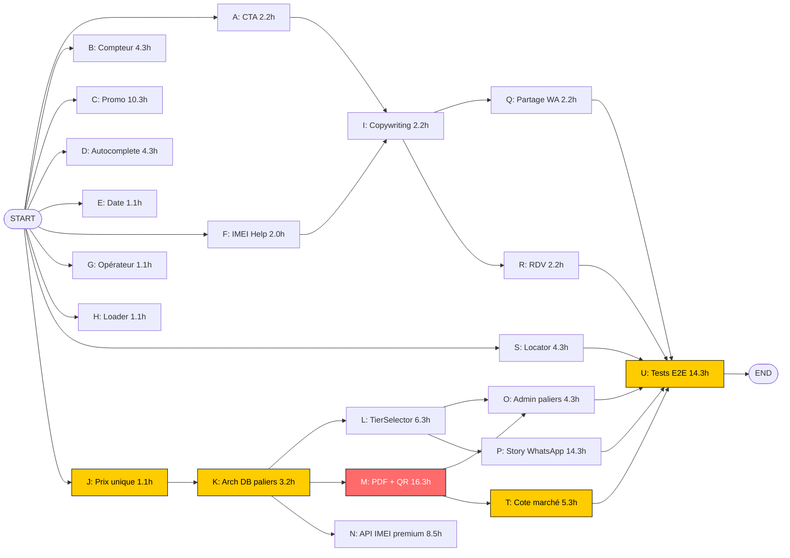
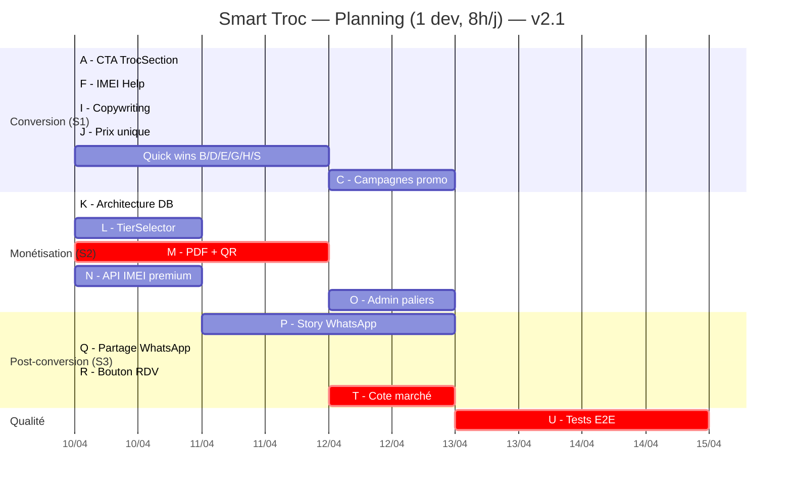

# 🚀 Roadmap Smart Troc — Optimisation UX & Monétisation

> Version : 2.0
> Date de création : 2026-04-09
> Source : Brief client + analyse technique
> Objectif : Maximiser la conversion, panier moyen et viralité

---

## 📊 Vue d'ensemble

3 sprints planifiés, ordonnés par ROI vs effort :

| Sprint | Thème | Durée | Impact attendu |
|--------|-------|-------|----------------|
| **Sprint 1** | Quick wins UX & friction | 3-4 jours | +20 % conversion |
| **Sprint 2** | Paliers tarifaires (revenue) | 5 jours | ×3-5 panier moyen |
| **Sprint 3** | Viralité & post-conversion | 3 jours | Acquisition organique |

---

## 🚨 Décisions stratégiques à valider avant de coder

- [ ] **Reformuler "Précision 98 %"** → "Analyse IA renforcée" ou "Diagnostic intelligent" (risque juridique de la promesse de précision)
- [ ] **Reformuler "Certificat d'Expertise certifié"** → "Rapport d'expertise XEPTION" (le terme "certifié" est légalement chargé)
- [ ] **Décider du compteur "+2 500 évalués"** :
  - Option A : compteur **réel** depuis Supabase (afficher seulement si > 500)
  - Option B : compteur **fictif** (risque crédibilité)
  - **Reco** : Option A avec seuil minimum
- [ ] **Décider du "+10 % crédit boutique"** :
  - Option A : système de campagnes admin avec dates (recommandé)
  - Option B : règle permanente (perd l'effet d'urgence)
  - Option C : booster ponctuel manuel
- [ ] **Valider les paliers tarifaires 150 / 500 / 1 000 XAF** et leurs contenus

---

# 🏁 SPRINT 1 — Quick wins UX & friction (3-4 jours)

## 1.1 Landing Page — Bouton CTA optimisé

### Contexte
Le bouton actuel sur la home/landing est petit, peu engageant. Le client demande un bouton large optimisé pouce mobile avec réassurance.

### Tâches
- [ ] Cibler le CTA bas de page dans `components/TrocSection.tsx` (monté par `pages/HomePage.tsx`)
- [ ] Élargir le bouton (min `w-full` sur mobile, hauteur ≥ 56px)
- [ ] Changer le texte → **"ESTIMER MON PRIX MAINTENANT"**
- [ ] Ajouter sous le bouton :
  - Texte : **"Seulement 150 F"** en gold
  - Logos **MoMo** + **Orange Money** (récupérer SVG officiels)
- [ ] Ajouter chevron `lucide-react` `ArrowRight` ou `Sparkles` pour l'attention
- [ ] Conserver l'identité visuelle Noir / Or / Blanc
- [ ] Tester sur 360px (Pixel 5), 414px (iPhone Pro), 768px (iPad)

### Fichiers concernés
- `components/TrocSection.tsx` (CTA principal)
- `pages/HomePage.tsx` (intégration section)
- `assets/icons/momo.svg`, `assets/icons/orange-money.svg` (à ajouter)

---

## 1.2 Preuve sociale — Compteur dynamique

### Contexte
Le client veut "Déjà +2 500 appareils évalués ce mois à Yaoundé" — il faut le rendre réel.

### Tâches
- [ ] Créer la requête Supabase : `count(*) FROM trade_in_requests WHERE created_at >= date_trunc('month', now())`
- [ ] Créer un hook `useTrocMonthlyCounter()` avec cache 5 min
- [ ] Logique d'affichage :
  - Si `count < 500` → masquer le compteur (pas crédible)
  - Si `500 ≤ count < 1000` → afficher "Évaluations en temps réel"
  - Si `count ≥ 1000` → afficher le vrai chiffre avec ville (depuis le profil utilisateur ou par défaut Yaoundé)
- [ ] Animer le compteur (montée progressive depuis 0 avec `framer-motion` ou CSS)
- [ ] Le placer sous le CTA

### Fichiers concernés
- `hooks/useTrocMonthlyCounter.ts` (nouveau)
- `components/home/SmartTrocCTA.tsx`

---

## 1.3 Urgence — Système de campagnes promo

> **Planning PERT** : tâche **C** — **hors chemin critique**. À planifier en parallèle des quick wins ou en fin de Sprint 1, pas avant les paliers (voir section PERT).

### Contexte
Le client veut "Offre de reprise +10% en crédit boutique valable aujourd'hui". Il faut un vrai système, sinon c'est ingérable.

### Tâches
- [ ] **DB** : créer table `troc_promo_campaigns` :
  ```sql
  CREATE TABLE troc_promo_campaigns (
    id UUID PRIMARY KEY DEFAULT gen_random_uuid(),
    name TEXT NOT NULL,
    bonus_percent NUMERIC(5,2) NOT NULL, -- ex: 10.00 pour +10%
    starts_at TIMESTAMPTZ NOT NULL,
    ends_at TIMESTAMPTZ NOT NULL,
    bonus_type TEXT CHECK (bonus_type IN ('store_credit', 'cash')) DEFAULT 'store_credit',
    active BOOLEAN DEFAULT TRUE,
    created_at TIMESTAMPTZ DEFAULT NOW()
  );
  CREATE INDEX idx_promo_active ON troc_promo_campaigns (starts_at, ends_at) WHERE active = TRUE;
  ```
- [ ] Edge function `get-active-promo` qui retourne la campagne active courante (ou null)
- [ ] Front : afficher l'urgence seulement si une campagne est active
- [ ] Texte dynamique : "Offre +{X}% en crédit boutique valable jusqu'au {date}"
- [ ] Appliquer le bonus dans `computeOfferV2` (ajouter `promoMultiplier` au calcul)
- [ ] Stocker `promo_campaign_id` dans `trade_in_requests` pour audit
- [ ] Admin : interface CRUD dans `AdminPanel` → onglet "Campagnes Troc"

### Fichiers concernés
- `supabase/migrations/XXX_troc_promo_campaigns.sql`
- `supabase/functions/get-active-promo/index.ts` (nouveau)
- `utils/trocPricing.ts` (intégrer le bonus)
- `components/admin/tabs/TrocPromoTab.tsx` (nouveau)
- `services/trocEvaluationService.ts`

---

## 1.4 Formulaire — Autocomplete marque/modèle

### Contexte
Le client veut une auto-complétion filtrable. **Déjà en place pour le modèle** (Argus + liste filtrée dans `SmartTrocForm`). Reste à faire : **marque** (select → combobox) et enrichir le catalogue / alias.

### Tâches
- [ ] Élargir `constants/trocCatalog.ts` avec un catalogue exhaustif :
  - 200+ modèles courants au Cameroun
  - Format `{ brand: 'Samsung', model: 'Galaxy A54 5G', aliases: ['a54', 'galaxy a54'] }`
- [ ] Créer un composant `<AutocompleteInput />` réutilisable :
  - Filtrage en temps réel (debounce 150ms)
  - Affichage max 6 suggestions
  - Touches `↑ ↓ Enter` pour navigation clavier
  - Fallback "Autre" si aucun match
- [ ] Remplacer le `<select>` marque + l'input modèle libre par 2 autocomplete
- [ ] Auto-fill : quand marque sélectionnée, le modèle suggère les modèles de cette marque
- [ ] Conserver la possibilité de saisie libre

### Fichiers concernés
- `constants/trocCatalog.ts` (élargir)
- `components/common/AutocompleteInput.tsx` (nouveau)
- `components/troc/SmartTrocForm.tsx`

---

## 1.5 Formulaire — "Je ne sais pas" date d'achat

### Contexte
Beaucoup de clients ne se souviennent pas de la date d'achat → friction.

### Tâches
- [ ] Ajouter checkbox/toggle "Je ne sais pas" à côté du champ date
- [ ] Si coché : désactiver le champ date + envoyer `purchaseDate: null` (ou sentinelle `unknown`)
- [ ] Côté `save-trade-in` : **assouplir la validation** (`purchaseDate` est **obligatoire aujourd'hui** — l.200+)
- [ ] Côté algo : si pas de date, appliquer une **pénalité d'âge moyenne** (équivalent 24 mois)
- [ ] Affichage admin : marquer ces évaluations "Âge non déclaré"

### Fichiers concernés
- `components/troc/SmartTrocForm.tsx`
- `utils/trocFormValidation.ts`
- `supabase/functions/save-trade-in/index.ts`
- `utils/trocPricing.ts`

---

## 1.6 IMEI — Pop-up tutoriel

### Contexte
Le client doit composer `*#06#` mais 30 % des utilisateurs ne savent pas.

### Tâches
- [ ] Créer composant `<ImeiHelpModal />` :
  - Titre : "Comment trouver mon IMEI ?"
  - 3 méthodes illustrées :
    1. **Composer `*#06#`** (avec GIF/SVG animé d'un clavier)
    2. **Réglages > À propos** (capture iPhone + Android)
    3. **Étiquette boîte** ou arrière de l'appareil
  - Bouton "Compris" qui ferme la modale
- [ ] Bouton `<Info />` (lucide-react) à droite du champ IMEI dans `ImeiChecker`
- [ ] Tracker l'ouverture du modal (analytics) pour mesurer l'usage

### Fichiers concernés
- `components/troc/ImeiHelpModal.tsx` (nouveau)
- `components/troc/ImeiChecker.tsx`

---

## 1.7 Paiement — Détection auto opérateur

### Contexte
Aujourd'hui le client n'a pas de sélection MoMo/OM (CamPay détecte côté serveur). Mais on peut afficher visuellement quel opérateur est détecté pour rassurer.

### Tâches
- [ ] Logique de détection (côté front) :
  ```ts
  const detectOperator = (phone: string): 'mtn' | 'orange' | null => {
    const cleaned = phone.replace(/\D/g, '');
    if (!cleaned.startsWith('6') && !cleaned.startsWith('2')) return null;
    // Préfixes MTN Cameroun : 67x, 68x, 65x, 67x, 671-679, 650-654, 680-689
    // Préfixes Orange Cameroun : 69x, 655-659, 685-689
    const prefix = cleaned.slice(0, 3);
    // ... mapping détaillé à finaliser avec table préfixes officielle
  };
  ```
- [ ] Afficher le logo de l'opérateur détecté à droite du champ phone (animation fade)
- [ ] Si numéro invalide ou non détecté → afficher icône `?` gris
- [ ] Ajouter une vraie table de préfixes (source : ART Cameroun)

### Fichiers concernés
- `utils/cameroonOperators.ts` (nouveau)
- `components/troc/TrocPayment.tsx`

---

## 1.8 Paiement — Loader dynamique amélioré

### Contexte
"Vérification de la transaction en cours... Préparez-vous à recevoir votre expertise."

### Tâches
- [ ] Mettre à jour le texte d'attente dans `TrocPayment.tsx`
- [ ] Animation : icône loader + texte qui change toutes les 3s :
  1. "Connexion sécurisée avec MoMo/Orange Money..."
  2. "Vérification de la transaction en cours..."
  3. "Préparez-vous à recevoir votre expertise..."
- [ ] Barre de progression simulée (UX rassurante, pas réelle)
- [ ] Tip en bas : "💡 La confirmation peut prendre jusqu'à 60 secondes"

### Fichiers concernés
- `components/troc/TrocPayment.tsx`

---

## 1.9 Copywriting global

### Tâches
- [ ] Remplacer "Évaluation IA avec analyse photos" → **"Scan visuel par IA"** (sans "98%")
- [ ] Remplacer "Score transparent" → **"Rapport d'expertise XEPTION"**
- [ ] Vérifier tous les `TROC_MESSAGES` dans `utils/trocMessages.ts`
- [ ] Vérifier les titres dans `SmartTrocForm.tsx`, `EvaluationResult.tsx`, `TrocVoucher.tsx`
- [ ] Audit complet : passer toutes les pages en revue pour cohérence ton/vocabulaire

### Fichiers concernés
- `utils/trocMessages.ts`
- Tous les composants `components/troc/`
- `pages/TrocPage.tsx`

---

## 1.10 Uniformisation du prix

### Tâches
- [ ] Ajouter `TROC_TIER_PRICES` / `TROC_BASE_PRICE_XAF = 150` dans `utils/trocPricing.ts` (fichier **existant**, algo v2)
- [ ] Remplacer toutes les occurrences hardcodées (CTA, formulaire, paiement, edge functions)
- [ ] Vérifier que `create-payment` utilise bien cette constante (et que sandbox=25 reste séparé)
- [ ] Tester la cohérence sur les 6 étapes du flow

### Fichiers concernés
- `utils/trocPricing.ts`
- `components/troc/*`
- `supabase/functions/create-payment/index.ts`

---

# 💰 SPRINT 2 — Paliers tarifaires (5 jours)

## 2.1 Architecture des paliers

### Spécifications
| Palier | Prix | Inclus |
|--------|------|--------|
| **Express** | 150 F | Estimation IA + Rapport texte |
| **Premium** | 500 F | Express + Certificat PDF + QR vérification |
| **Sûreté** | 1 000 F | Premium + Vérif IMEI réelle (API antivol blacklist mondiale) |

### Tâches
- [ ] Définir l'enum `TrocTier = 'express' | 'premium' | 'safety'`
- [ ] Ajouter colonne `tier` à `troc_payments` et `trade_in_requests`
- [ ] Migration SQL :
  ```sql
  ALTER TABLE troc_payments ADD COLUMN tier TEXT CHECK (tier IN ('express', 'premium', 'safety')) DEFAULT 'express';
  ALTER TABLE trade_in_requests ADD COLUMN tier TEXT CHECK (tier IN ('express', 'premium', 'safety'));
  ```
- [ ] Définir les prix dans `utils/trocPricing.ts` :
  ```ts
  export const TROC_TIER_PRICES = {
    express: 150,
    premium: 500,
    safety: 1000,
  } as const;
  ```

---

## 2.2 UI — Sélection du palier

### Tâches
- [ ] Créer composant `<TierSelector />` à afficher avant le paiement :
  - 3 cards verticales (mobile) ou horizontales (desktop)
  - Card "Premium" mise en avant (badge "Le + populaire")
  - Détail des inclusions par palier
  - Toggle au-dessus du `<TrocPayment />`
- [ ] Modifier `useTradeIn.ts` :
  - Ajouter `selectedTier: TrocTier`
  - Passer le tier dans `createPayment(sessionKey, phone, customerName, customerEmail, tier)`
- [ ] Modifier `create-payment` edge function pour utiliser le bon montant selon le tier

### Fichiers concernés
- `components/troc/TierSelector.tsx` (nouveau)
- `components/troc/TrocPayment.tsx`
- `hooks/useTradeIn.ts`
- `services/trocEvaluationService.ts`
- `supabase/functions/create-payment/index.ts`

---

## 2.3 Niveau Premium — Génération PDF + QR code

### Tâches
- [ ] Choisir une lib de génération PDF :
  - **Recommandation** : `pdf-lib` (léger, fonctionne côté edge function Deno)
  - Alternative : `jspdf` côté client (plus simple mais moins propre)
- [ ] Designer le template PDF :
  - En-tête XEPTION (logo + couleurs)
  - Données client (anonymisées partiellement)
  - Détails appareil (marque, modèle, IMEI)
  - Score d'état + détail des critères
  - Offre de reprise XEPTION
  - QR code en bas (lien vers page publique de vérif)
  - Signature numérique (hash + date)
- [ ] Créer table `troc_certificates` :
  ```sql
  CREATE TABLE troc_certificates (
    id UUID PRIMARY KEY DEFAULT gen_random_uuid(),
    trade_in_id UUID REFERENCES trade_in_requests(id),
    reference TEXT UNIQUE NOT NULL,  -- ex: XEP-CERT-A8K9L2M
    pdf_url TEXT,                    -- URL Supabase storage
    qr_token TEXT UNIQUE NOT NULL,   -- token vérification
    verified_count INT DEFAULT 0,    -- nombre de scans du QR
    created_at TIMESTAMPTZ DEFAULT NOW()
  );
  ```
- [ ] Edge function `generate-certificate` :
  - Input : `tradeInId`
  - Génère le PDF
  - Upload sur Supabase Storage bucket `certificates/`
  - Insère dans `troc_certificates`
  - Retourne `{ pdfUrl, qrUrl }`
- [ ] Page publique de vérification : `/verify/:qrToken`
  - Lit `troc_certificates` par token
  - Incrémente `verified_count`
  - Affiche : référence, date, modèle, état, statut "Certificat valide" / "Expiré"

### Fichiers concernés
- `supabase/functions/generate-certificate/index.ts` (nouveau)
- `supabase/migrations/XXX_troc_certificates.sql`
- `pages/VerifyCertificatePage.tsx` (nouveau)
- `components/troc/TrocVoucher.tsx` (ajouter bouton "Télécharger certificat")

---

## 2.4 Niveau Sûreté — Brancher l'API IMEI premium déjà intégrée

### ✅ Ce qui est DÉJÀ en place

| Élément | État | Référence |
|---------|------|-----------|
| Provider premium | ✅ **imeicheck.net** intégré | [check-imei/index.ts:592](supabase/functions/check-imei/index.ts#L592) |
| Secret env | ✅ `IMEI_PREMIUM_API_KEY` câblé | Variable Deno |
| Niveau d'assurance | ✅ `assuranceLevel: 'basic' \| 'premium'` retourné | check-imei |
| Stockage DB | ✅ Colonne `imei_assurance_level` dans `trade_in_requests` | save-trade-in |
| Cache TAC | ✅ Table `tac_cache` avec apprentissage auto | `dbTacWrite()` |
| Seed KB | ✅ ~100 TACs hardcodés (Samsung, Apple, Xiaomi, Tecno...) | `KNOWN_TAC_SEED_KB` |
| Cascade fallback | ✅ Seed → DB → Gemini → imei.info → historique → Gemini | `Deno.serve` handler |

**Bottom line** : la vérif blacklist mondiale fonctionne **déjà**, mais elle est gouvernée par la présence de la clé env, pas par le palier choisi côté client.

### ⚠️ Ce qu'il reste à faire pour le palier Sûreté

- [ ] **Brancher le tier client → tier IMEI** dans `save-trade-in` et `check-imei` :
  - Passer `tier: 'premium'` dans le body de `check-imei` quand `troc_payments.tier === 'safety'`
  - Si pas Sûreté → forcer `tier: 'basic'` même si la clé premium existe (économie d'API calls)
- [ ] **UI palier Sûreté** : afficher le badge "🛡️ Vérifié blacklist mondiale" si `imei_assurance_level === 'premium'`
- [ ] **UI palier Express/Premium** : badge plus modeste "Vérification IMEI standard"
- [ ] **Monitoring coûts** : exposer un compteur admin "appels imeicheck.net ce mois" (table `imei_premium_calls` ou simple count sur `trade_in_requests WHERE imei_assurance_level='premium'`)
- [ ] **Quota de sécurité** : si > X appels/jour, fallback en basic + alerte admin (évite la facture qui s'envole)
- [ ] **Doc opérationnelle** : noter dans `CLAUDE.md` ou un README admin que la rotation de la clé API se fait via `supabase secrets set IMEI_PREMIUM_API_KEY="..."`

### Fichiers concernés
- `supabase/functions/check-imei/index.ts` (lire le `tier` du body, gating de l'appel premium)
- `supabase/functions/save-trade-in/index.ts` (lire `troc_payments.tier` avant de relancer check-imei premium)
- `services/trocEvaluationService.ts` (passer le tier dans `checkImei`)
- `components/troc/ImeiChecker.tsx` (badge selon assuranceLevel)
- `components/troc/TrocVoucher.tsx` (badge final sur le bon)
- `components/admin/tabs/TrocPaymentsTab.tsx` (compteur appels premium)

### Note pour le PERT
**Tâche N** : durée révisée de **8.5 h → 4 h** (l'infra existe, c'est du câblage). Recalculer la marge du chemin critique en conséquence.

---

## 2.5 Admin — Suivi des paliers

### Tâches
- [ ] Ajouter colonne `tier` dans `TrocPaymentsTab` (avec badges colorés)
- [ ] Filtrer par tier (Express / Premium / Sûreté / Tous)
- [ ] Compteurs par tier (revenue par palier)
- [ ] Statistiques : ratio Express vs Premium vs Sûreté
- [ ] Export CSV des certificats émis

### Fichiers concernés
- `components/admin/tabs/TrocPaymentsTab.tsx`
- `components/admin/tabs/TrocTab.tsx`

---

# 🚀 SPRINT 3 — Viralité & post-conversion (3 jours)

## 3.1 Image story WhatsApp auto-générée

### Contexte
"Génération automatique d'une image format Story/Statut WhatsApp avec modèle + prix + logo XEPTION"

### Tâches
- [ ] Choisir l'approche :
  - **Option A — Edge function avec `@napi-rs/canvas`** ou **`satori` + `resvg`** (génération côté serveur)
  - **Option B — Côté client avec `html2canvas`** (plus simple mais moins propre)
  - **Recommandation** : Option A pour avoir une vraie URL partageable
- [ ] Designer le template story (1080×1920px) :
  - Fond noir avec accents or
  - Logo XEPTION en haut
  - Modèle d'appareil (gros, gras)
  - **Prix estimé** ULTRA-VISIBLE (taille 200pt+)
  - Tag "Évalué par XEPTION • +10% en boutique"
  - QR code en bas (vers page d'estimation publique du modèle)
- [ ] Edge function `generate-story-image` :
  - Input : `tradeInId`
  - Génère PNG 1080×1920
  - Upload sur Supabase Storage `stories/`
  - Retourne URL publique
- [ ] Bouton "Partager sur WhatsApp" dans `TrocVoucher` :
  - Télécharge l'image
  - Ouvre `whatsapp://send?text=...&image=...` (deep link mobile)
  - Fallback web : `https://wa.me/?text=...`

### Fichiers concernés
- `supabase/functions/generate-story-image/index.ts` (nouveau)
- `components/troc/TrocVoucher.tsx`
- `components/troc/ShareStoryButton.tsx` (nouveau)

---

## 3.2 Partage WhatsApp du bon

### Tâches
- [ ] Bouton "Envoyer le bon par WhatsApp" dans `TrocVoucher`
- [ ] Message pré-rempli :
  ```
  🎉 Mon évaluation Smart Troc XEPTION

  📱 {marque} {modèle}
  💰 Valeur de reprise : {valeur} XAF
  🏪 Crédit boutique disponible

  🔗 Vérifier : {qr_url}
  📞 Boutique : +237 6XX XXX XXX
  ```
- [ ] Deep link WhatsApp : `whatsapp://send?text={encoded}`
- [ ] Tracker les partages (analytics) pour mesurer la viralité

### Fichiers concernés
- `components/troc/TrocVoucher.tsx`
- `utils/whatsappShare.ts` (nouveau)

---

## 3.3 Bouton RDV en boutique

### Tâches
- [ ] Bouton CTA fort dans `TrocVoucher` : **"📞 Prendre RDV en boutique"**
- [ ] 2 options proposées en modal :
  1. **WhatsApp boutique** — deep link vers numéro store avec message pré-rempli
  2. **Choisir un créneau** — vers `pages/AppointmentPage.tsx` (à créer ou intégrer si existant)
- [ ] Message WhatsApp pré-rempli :
  ```
  Bonjour XEPTION, je viens pour valider ma reprise Smart Troc.
  Référence bon : {voucher_reference}
  Appareil : {marque} {modèle}
  Valeur évaluée : {valeur} XAF
  ```

### Fichiers concernés
- `components/troc/TrocVoucher.tsx`
- `pages/AppointmentPage.tsx` (à créer si besoin)

---

## 3.4 Carte boutiques + horaires

### Tâches
- [ ] Données boutiques (créer fichier de config ou table DB) :
  - Mfoundi Mall (Yaoundé) — adresse, horaires, téléphone, lien Google Maps
  - Olembé (Yaoundé) — idem
- [ ] Composant `<StoreLocator />` :
  - Cards des 2 boutiques
  - Adresse + horaires actuels (badge "Ouvert maintenant" / "Fermé")
  - Bouton "Itinéraire" (lien Google Maps)
  - Bouton "Appeler"
- [ ] Intégrer dans :
  - Bas de `TrocVoucher`
  - Bas de la `HomePage`
  - Page dédiée `pages/StoresPage.tsx`

### Fichiers concernés
- `constants/stores.ts` (nouveau)
- `components/common/StoreLocator.tsx` (nouveau)
- `components/troc/TrocVoucher.tsx`
- `pages/HomePage.tsx`
- `pages/StoresPage.tsx` (nouveau)

---

## 3.5 Analyse IA enrichie — Cote du marché

### Contexte
"Ajouter variable 'Cote du Marché' dans le texte de l'analyse (ex: 'La valeur du S24 Ultra est stable à Yaoundé ce mois-ci')"

### Tâches
- [ ] Logique de "cote" basée sur les données existantes :
  - Comparer le prix marché actuel (market-price-intel) vs prix moyen des 3 derniers mois (stocker dans une table)
  - Si écart < 3 % → **"Stable"**
  - Si écart > +5 % → **"En hausse"**
  - Si écart < -5 % → **"En baisse"**
- [ ] Table `market_price_history` (snapshot mensuel) :
  ```sql
  CREATE TABLE market_price_history (
    id UUID PRIMARY KEY DEFAULT gen_random_uuid(),
    device_brand TEXT NOT NULL,
    device_model TEXT NOT NULL,
    snapshot_date DATE NOT NULL,
    reference_price NUMERIC,
    UNIQUE(device_brand, device_model, snapshot_date)
  );
  ```
- [ ] Job de snapshot mensuel (edge function programmée ou trigger admin)
- [ ] Inclure la cote dans `evaluate-device` réponse :
  ```ts
  marketTrend: {
    label: 'Stable' | 'En hausse' | 'En baisse',
    deltaPercent: number,
    city: 'Yaoundé',
  }
  ```
- [ ] Afficher dans `EvaluationResult.tsx`

### Fichiers concernés
- `supabase/migrations/XXX_market_price_history.sql`
- `supabase/functions/evaluate-device/index.ts`
- `components/troc/EvaluationResult.tsx`

---

# 🧪 SPRINT 4 (bonus) — Tests E2E Playwright

## Tâches
- [ ] Compléter `e2e/smart-troc.spec.ts` avec les nouveaux composants
- [ ] Tests par sprint :
  - Sprint 1 : tests CTA, autocomplete, modal IMEI, détection opérateur
  - Sprint 2 : tests sélection palier, génération PDF, page de vérification
  - Sprint 3 : tests partage WhatsApp (deep links), locator boutiques
- [ ] Configurer CI/CD GitHub Actions (optionnel)
- [ ] Tests de régression visuelle avec `--update-snapshots`

---

# 📋 Checklist transverse

## Performance (réseau 4G Cameroun)
- [ ] Lazy-load des nouveaux composants (TierSelector, ImeiHelpModal, etc.)
- [ ] Optimiser les images (WebP + lazy loading)
- [ ] Poids total page Troc < 500 KB initial
- [ ] Temps de réponse IA < 15s sur 4G

## Identité visuelle
- [ ] Toutes les nouvelles UI respectent le code Noir / Or / Blanc
- [ ] Cohérence typographique (font-tech pour titres, font-sans pour body)
- [ ] Spacing cohérent (multiples de 4px)

## Mesure & analytics
- [ ] Ajouter événements tracking :
  - `troc_cta_clicked` (depuis quelle page)
  - `troc_form_step_completed`
  - `troc_tier_selected` (express / premium / safety)
  - `troc_payment_completed` (avec montant)
  - `troc_voucher_shared` (whatsapp / story)
  - `troc_appointment_requested`
- [ ] Dashboard admin avec funnel : Landing → Form → Photos → IMEI → Paiement → Voucher → Partage / RDV
- [ ] Taux de conversion par tier

## Compliance
- [ ] Mentionner dans les CGV : prix non-remboursable
- [ ] Mentionner : "Évaluation indicative, validation finale en boutique"
- [ ] RGPD : politique de conservation des photos + IMEI

---

# 🎯 Priorisation finale recommandée

### Si tu n'as que **2 jours** :
1. CTA optimisé (1.1)
2. Pop-up IMEI (1.6)
3. Partage WhatsApp (3.2)
4. Bouton RDV (3.3)
5. Copywriting (1.9 + uniformisation prix 1.10)

### Si tu as **1 semaine** :
+ Détection opérateur (1.7)
+ Autocomplete (1.4)
+ "Je ne sais pas" date (1.5)
+ Loader paiement (1.8)
+ Carte boutiques (3.4)

### Si tu as **3 semaines** :
+ Sprint 2 complet (paliers tarifaires)
+ Image story WhatsApp (3.1)
+ Cote du marché (3.5)
+ Tests E2E (Sprint 4)

---

# 🚨 Points de vigilance

- **Ne JAMAIS hardcoder des prix** : tout passe par `utils/trocPricing.ts` (+ env sandbox si besoin)
- **Toujours recalculer offer_cash server-side** dans `save-trade-in` (ne pas trust le front)
- **Versionner l'algo** : `pricing_rule_version` mis à jour si la formule change
- **Stocker l'IMEI assurance level** pour audit (basic vs premium)
- **Backup avant migration SQL** : toute migration doit être réversible
- **Tester sur 4G dégradée** (DevTools throttling) avant de pousser
- **Vérifier le coût des API premium** (IMEI, génération PDF) en production

---

*Dernière mise à jour : 2026-04-09 (roadmap + PERT v2.1)*
*Auteur : équipe XEPTION + IA*

---

# 📐 Analyse PERT — Planification & chemin critique

> **v2.1** — CPM recalculé : **J** découplé de **C** ; chemin critique corrigé (plus de somme séquentielle O+P).

## Hypothèses

- **Profil** : 1 développeur full-time (8 h/jour)
- **Notation** : durées en heures
- **Formule PERT** : `Durée_estimée = (Optimiste + 4 × Probable + Pessimiste) / 6`
- **Variance** : `σ² = ((Pessimiste - Optimiste) / 6)²`
- **Fin de projet (U)** : tests E2E bloquants sur le **cœur métier** (O, P, Q, R, S, T). Les quick wins B/D/E/G/H et l'IMEI premium **N** peuvent être testés en continu sans retarder la date de fin.

## Tableau des tâches

| ID | Tâche | Optimiste (h) | Probable (h) | Pessimiste (h) | **Estimée (h)** | Variance | Prédécesseurs |
|----|-------|---------------|--------------|----------------|-----------------|----------|---------------|
| **A** | CTA optimisé (1.1) | 1 | 2 | 4 | **2.2** | 0.25 | — |
| **B** | Compteur dynamique (1.2) | 2 | 4 | 8 | **4.3** | 1.00 | — |
| **C** | Système campagnes promo (1.3) | 6 | 10 | 16 | **10.3** | 2.78 | — |
| **D** | Autocomplete marque/modèle (1.4) | 2 | 4 | 8 | **4.3** | 1.00 | — |
| **E** | "Je ne sais pas" date (1.5) | 0.5 | 1 | 2 | **1.1** | 0.06 | — |
| **F** | Pop-up tutoriel IMEI (1.6) | 1 | 2 | 3 | **2.0** | 0.11 | — |
| **G** | Détection auto opérateur (1.7) | 0.5 | 1 | 2 | **1.1** | 0.06 | — |
| **H** | Loader paiement amélioré (1.8) | 0.5 | 1 | 2 | **1.1** | 0.06 | — |
| **I** | Copywriting global (1.9) | 1 | 2 | 4 | **2.2** | 0.25 | A, F |
| **J** | Uniformisation prix (1.10) | 0.5 | 1 | 2 | **1.1** | 0.06 | — |
| **K** | Architecture DB paliers (2.1) | 2 | 3 | 5 | **3.2** | 0.25 | J |
| **L** | UI sélecteur palier (2.2) | 4 | 6 | 10 | **6.3** | 1.00 | K |
| **M** | Génération PDF + QR (2.3) | 10 | 16 | 24 | **16.3** | 5.44 | K |
| **N** | API IMEI premium (2.4) | 5 | 8 | 14 | **8.5** | 2.25 | K |
| **O** | Admin paliers (2.5) | 3 | 4 | 7 | **4.3** | 0.44 | L, M |
| **P** | Image story WhatsApp (3.1) | 8 | 14 | 22 | **14.3** | 5.44 | L |
| **Q** | Partage WhatsApp bon (3.2) | 1 | 2 | 4 | **2.2** | 0.25 | I |
| **R** | Bouton RDV boutique (3.3) | 1 | 2 | 4 | **2.2** | 0.25 | I |
| **S** | Locator boutiques (3.4) | 3 | 4 | 7 | **4.3** | 0.44 | — |
| **T** | Cote du marché (3.5) | 3 | 5 | 9 | **5.3** | 1.00 | M |
| **U** | Tests E2E Playwright | 8 | 14 | 22 | **14.3** | 5.44 | O, P, Q, R, S, T |

**Charge totale (somme des tâches)** : 110.5 h ≈ **14 jours-homme** si tout est fait séquentiellement par une seule personne.

**Durée calendaire minimale (1 dev, parallélisme)** : définie par le **chemin critique** ci-dessous ≈ **40 h**.

## Graphe de dépendances (PERT)



**Légende** :
- 🟡 Jaune = **chemin critique** (marge nulle)
- 🔴 Rouge = tâche la plus longue du projet (**M** — PDF + QR)
- **C** (promo) = branche parallèle, **hors chemin critique**

## Calcul CPM — dates au plus tôt (ES) / au plus tard (LS)

| Tâche | Durée | ES | EF | LS | LF | Marge | Critique ? |
|-------|-------|----|----|----|----|-------|------------|
| A | 2.2 | 0 | 2.2 | 23.7 | 25.9 | 23.7 | Non |
| B | 4.3 | 0 | 4.3 | 35.6 | 39.9 | 35.6 | Non |
| C | 10.3 | 0 | 10.3 | 29.6 | 39.9 | 29.6 | Non |
| D | 4.3 | 0 | 4.3 | 35.6 | 39.9 | 35.6 | Non |
| E | 1.1 | 0 | 1.1 | 38.8 | 39.9 | 38.8 | Non |
| F | 2.0 | 0 | 2.0 | 23.9 | 25.9 | 23.9 | Non |
| G | 1.1 | 0 | 1.1 | 38.8 | 39.9 | 38.8 | Non |
| H | 1.1 | 0 | 1.1 | 38.8 | 39.9 | 38.8 | Non |
| I | 2.2 | 2.2 | 4.4 | 23.7 | 25.9 | 21.5 | Non |
| **J** | 1.1 | 0 | 1.1 | 0 | 1.1 | **0** | **Oui** |
| **K** | 3.2 | 1.1 | 4.3 | 1.1 | 4.3 | **0** | **Oui** |
| L | 6.3 | 4.3 | 10.6 | 5.3 | 11.6 | 1.0 | Non |
| **M** | 16.3 | 4.3 | 20.6 | 4.3 | 20.6 | **0** | **Oui** |
| N | 8.5 | 4.3 | 12.8 | 31.4 | 39.9 | 27.1 | Non |
| O | 4.3 | 20.6 | 24.9 | 21.6 | 25.9 | 1.0 | Non |
| P | 14.3 | 10.6 | 24.9 | 11.6 | 25.9 | 1.0 | Non |
| Q | 2.2 | 4.4 | 6.6 | 37.7 | 39.9 | 33.3 | Non |
| R | 2.2 | 4.4 | 6.6 | 37.7 | 39.9 | 33.3 | Non |
| S | 4.3 | 0 | 4.3 | 35.6 | 39.9 | 35.6 | Non |
| **T** | 5.3 | 20.6 | 25.9 | 20.6 | 25.9 | **0** | **Oui** |
| **U** | 14.3 | 25.9 | 40.2 | 25.9 | 40.2 | **0** | **Oui** |

> Les marges sont arrondies au 0,1 h près. Recalibrer après le premier sprint réel.

## 🔥 Chemin critique

```
START → J (Prix unique 1.1 h)
      → K (Architecture DB paliers 3.2 h)
      → M (PDF + QR 16.3 h)          ← goulot principal
      → T (Cote du marché 5.3 h)
      → U (Tests E2E 14.3 h)
      → END
```

**Durée du chemin critique** : **40.2 h ≈ 5 jours ouvrés** (1 dev, 8 h/j)

| Métrique | Valeur |
|----------|--------|
| Parallélisme utile (ex. **L** + **M** + **N** après **K**) | Oui — ne raccourcit pas le critique tant que **M** dure |
| **C** (promo 10.3 h) | Peut se faire **en parallèle** des quick wins sans retarder la fin |
| Séquence stricte de toutes les tâches | 110.5 h ≈ **14 jours** |

## 📊 Analyse statistique (chemin critique J→K→M→T→U)

**Somme des variances** :
σ²(J) + σ²(K) + σ²(M) + σ²(T) + σ²(U)
= 0.06 + 0.25 + 5.44 + 1.00 + 5.44 = **12.19**

**Écart-type** : σ ≈ **3.49 h**

**Intervalles (durée critique μ = 40.2 h)** :
- **68 %** (μ ± 1σ) : **37 h – 44 h** (~4,6 – 5,5 jours)
- **95 %** (μ ± 2σ) : **33 h – 47 h** (~4,1 – 5,9 jours)

**Recommandation** : marge **+15 %** → planifier **~46 h (~6 jours)** pour imprévus (PDF, API IMEI fournisseur, E2E instables).

## 🎯 Optimisations possibles

### Réduire le chemin critique

| Action | Gain estimé | Coût |
|--------|-------------|------|
| **M** : PDF client (`jspdf`) sans QR en V1 | ~8–10 h | Moins de confiance / vérif publique |
| Reporter **T** (cote marché) après mise en prod | ~5 h | Analyse moins « premium » |
| **U** : happy path Playwright uniquement | ~8 h | Régressions possibles |
| Paralléliser **M** avec freelance | ~16 h calendaires | Budget ~150 000 XAF |
| Reporter **C** (promo) après lancement paliers | 0 h sur critique | Urgence marketing en texte statique |

### MVP conversion (chemin critique ~18 h ≈ 2,5 jours)

Sans paliers PDF ni cote marché — **conversion d'abord** :

```
A + F + I → Q + R  (landing + post-éval, ~8 h)
J → K → L          (tier Express 150 F seul, ~10 h, en parallèle partiel)
U_min              (smoke E2E happy path, ~4 h)
```

**C**, **M**, **P**, **T**, **N** = **phase 2** (monétisation / viralité).

## 📅 Diagramme de Gantt (1 dev — chemin critique en priorité)



---

*PERT mis à jour : 2026-04-09 (v2.1 — CPM corrigé)*
*Estimations à recalibrer après chaque sprint réel*
